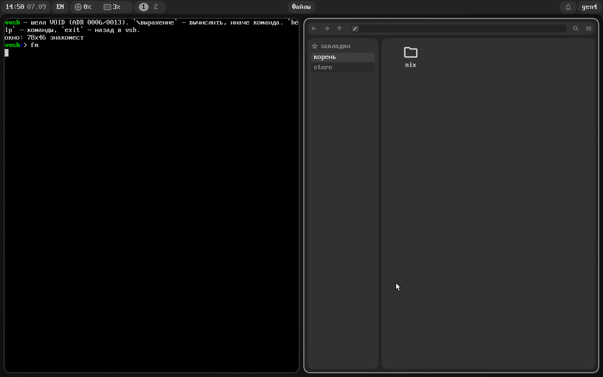
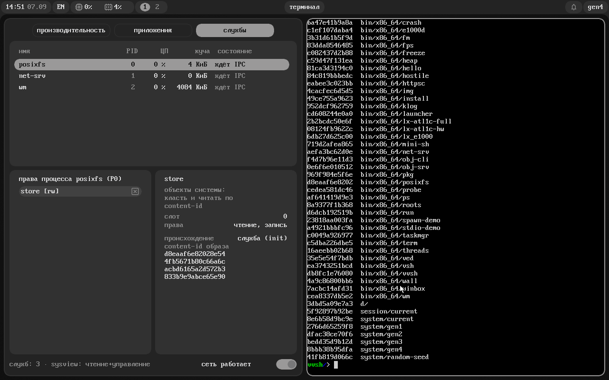
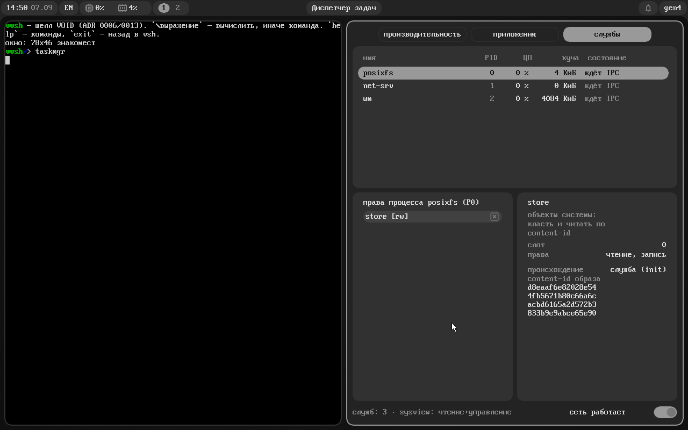

# VOID

English · **[Русский](README.md)**

An operating system with **no file system and no users**.

Instead of files there is a space of immutable objects addressed by the hash of their
contents. Instead of access permissions there are capabilities: unforgeable references that
can only be narrowed. Instead of `/etc` and a package manager there is a configuration
written in the system's own language, which the system evaluates *itself* and commits as a
new generation — and rolling back is moving a single root.

A microkernel in Rust, two architectures (riscv64 and x86_64) from one source tree, its own
compositor and shell. There is no Linux kernel inside — yet VOID runs **unmodified drivers
from the Linux kernel** as ordinary processes.



---

## Try it in five minutes

```sh
git clone <this-repository> && cd VOID
Code/tools/run.sh --build-only                               # build the kernel
nix-shell shell.nix --run 'Code/boot/mkboot.sh'              # → Code/boot/void.iso (~88 MiB)

qemu-system-x86_64 -machine q35 -m 1280M -smp 2 \
  -cdrom Code/boot/void.iso -boot d -accel kvm -cpu host
```

Prebuilt ISOs are published under **Releases**. It is a **live image**: the system comes up
straight into the windowed session and works in full, and everything you change lives until
reboot. To keep it, run `install` (it deploys VOID onto a SATA disk; a disk that is not
partitioned for VOID is left untouched).

Your first five minutes:

| | |
|---|---|
| `Super+Return` | new terminal window |
| `Super+H` / `Super+L` | move between columns · `Super+Q` closes |
| `fm` · `taskmgr` · `roots` | files · processes and their rights · store roots |
| `ls / ; (+ 1 2) ; ls \| grep vv \| count` | the shell: commands and Lisp on one line |
| `gens` · `switch gen2` | system generations and rollback |

Writing to a USB stick: `sudo dd if=Code/boot/void.iso of=/dev/sdX bs=4M status=progress && sync`
(**this erases the stick** — check the letter). Set the BIOS to AHCI mode; some laptops need
Legacy USB for a USB keyboard.

---

## What makes it unusual

### 1. The disk is one tree of values, not a file system

The unit of storage is an immutable value addressed by the BLAKE3 hash of its contents.
Identical contents are stored once. A "change" is a new object plus an atomic move of a named
root, which makes version history and rollback free, as in git.

The kernel does not know the word "file" at all. Directories, paths and `open/read/write` are
a **personality**: an ordinary userspace server, `posixfs`, that translates POSIX into
objects. Want different semantics — another server stands next to it, and the kernel does not
change.

You can look at this from inside the system: `roots` lists the roots and their content-ids.



### 2. There are no permissions — there are capabilities

No root, no users, no `chmod`. Access to anything — an object, a root, an IPC endpoint, a
device, the screen — is an unforgeable reference carrying a set of rights, and it can only be
**narrowed** when passed on, and **revoked**. The compositor owns the framebuffer and does not
hand it to windows; the bar is allowed to see processes only because the owner named it in the
configuration; the machine can be powered off by whoever was given that right.

The task manager shows this literally: every process lists the rights it holds, and any of
them can be taken away with the mouse.



### 3. The system is described in the language you work in

`vvsh` is a small homoiconic Lisp. It is both the shell (`ls /` and `(+ 1 2)` on one line;
pipelines carry **values**, not bytes) and the configuration language: the system lives in
`/etc/system/*.vv`. `rebuild` evaluates them **on VOID itself** and commits a new generation,
`gens` lists them, `switch` rolls back. No host Nix is needed — same model, own foundation.

Packages are declared in the same place: `want = ["nerd-fonts-fira-mono"]` → `rebuild` → the
font is on PATH. Rolling the system back rolls the packages back too, because it is the very
same move of a root.

### 4. Linux drivers are guests, not the foundation

A driver can live as an ordinary process: MMIO registers, DMA memory and interrupts are handed
out as capabilities. On top of that sits a Linux-API shim (`lx_emul` plus the `Lx_kit`
runtime), and **unmodified `.c` files from the Linux kernel** compile and execute on VOID.
Proven with `e1000`: the very same `e1000_hw.c` / `e1000_main.c` from Linux 6.18 resets the
card, builds DMA rings, receives packets on interrupts and answers `ping`.

The point is not e1000 but the road: the long tail of hardware does not have to be rewritten
for the system to run on a real laptop.

---

## What already works

**Kernel.** A microkernel (about sixty system calls): a persistent content-addressed store
with GC, capabilities with attenuation and revocation, synchronous IPC that passes rights,
processes and threads, lazy heaps, futexes, process checkpointing (freeze a computation,
resume it after a reboot), and **multicore** (the scheduler runs on every core of the
machine).

**Graphics.** Its own compositor: a scrollable tiling ribbon of columns and workspaces (the
niri model), windows living in shared memory, animations, pointer grab, notifications and
persistent sessions (a reboot puts the windows back). Its own vector format `.vg` and
rasteriser, its own toolkit, theming from the configuration.

**Programs.** Terminal, file manager (trash, `Delete`), task manager (per-process CPU and
memory, rights, a network switch), bar, launcher, editor, image viewer, store-root browser,
`pkg`, `klog`, microbenchmarks, frame-timing tools.

**The shell speaks English too** — one line in the config: `ui("language", "en")`. The kernel log
stays in Russian: it is read by whoever repairs the system, not by whoever uses it.

**Hardware.** Boots through GRUB (multiboot2) on a real machine: framebuffer, PS/2, AHCI,
installation onto a SATA disk, e1000 and virtio-net, virtio-blk/rng, an xHCI keyboard, CMOS
RTC, jitter entropy. Verified on an ASUS X54C.

**Networking.** Its own userspace stack (vendored smoltcp): DHCP, DNS, TCP/UDP and an HTTPS
client on rustls — that is how packages are fetched.

**Compatibility.** A Rust `std` port (plain cargo, `*-unknown-void` targets), real
uutils/coreutils, the C world through a cross-gcc and `void-libc` (GNU hello and bzip2 built
from nixpkgs recipes), a Linux personality (unmodified static-musl binaries — busybox runs),
and WASI through wasmi.

### Speed

Measured on the development bench (QEMU q35, KVM, `-cpu host`, 2 cores, Intel i5-9500). The
numbers come from the `bench` command inside the system itself, so they can be re-checked.

| Operation | ns/op |
|---|---:|
| system call (`yield`) | 637 |
| **IPC round trip between processes** | **2,423** |
| page fault (lazy page) | 1,353 |
| launching a program: full `exec` cycle | 808,855 |

Fast IPC is a design decision, not an optimisation: a synchronous rendezvous with direct
buffer delivery instead of "two system calls per side plus the scheduler". Microkernel
structure rests on it: the compositor, the file server and the network stack are ordinary
processes.

---

## What is missing

This list is as honest and as complete as we know how to make it. It is here because these
limits will be found anyway — better that the system names them first.

- **No sound at all** — there are no drivers.
- **No graphics acceleration**: the compositor draws into the framebuffer with the CPU. There
  is no vsync and no second buffer per window, so fast motion can tear.
- **No Wi-Fi.** Wired networking is e1000 and virtio-net only; on any other chip the system
  says "no drivers" honestly instead of pretending.
- **BIOS/MBR only.** UEFI, GPT and NVMe are not supported; `install` erases the whole disk.
- **No time zones** (everything is UTC) and no clock discipline — there is no NTP.
- **No file permissions** (uid/gid/mode) — and there never will be: VOID has no users and no
  root, and access is handed out as capability objects. There are no symlinks of our own either
  (only inside package trees). A file is held whole in the personality's memory: 8 MiB today.
- **Security has not been audited.** The capability model is exercised by our own red team
  (`Code/tools/redteam.py` plus the `probe` probe), but that is not an audit.
- **This is not a production OS** and does not claim to be one.

---

## Building from source

You need `nix-shell` (QEMU, GRUB, mtools) and the rustup toolchain from
`Code/rust-toolchain.toml`.

```sh
Code/tools/run.sh                    # build and run x86_64 with graphics (one command)
Code/tools/run.sh --riscv            # riscv64: text console, no graphics there
Code/tools/run.sh --help             # all flags: --fresh, --headless, --net, --script …
```

`run.sh` enters `nix-shell` by itself if the tools are not on PATH. To leave QEMU press
`Ctrl-A`, then `X`. One disk serves both architectures: write a file on one and read it on the
other (`bin/riscv64/*` and `bin/x86_64/*` live side by side in the same store).

The checks we use ourselves:

```sh
Code/tools/run.sh --script Code/tools/soak-smp.txt out/   # long multicore soak
python3 Code/tools/redteam.py                             # red team: confinement
python3 Code/tools/shot.py diff a.png b.png               # numbers from screenshots
```

## Repository layout

```
Code/
├── kernel/            microkernel: store, capabilities, IPC, processes, scheduler, drivers
│   └── src/arch/      architecture contract: riscv64 (SBI/PLIC/Sv39) · x86_64 (GDT/LAPIC/PCI/SMP)
├── programs/user/     userspace: compositor, bar, terminal, managers, shell, servers
├── programs/lx-linux/ linux/*.h shims, the Lx_kit runtime, unmodified .c from the Linux kernel
├── libs/              void-abi · void-store · vvsh-core (Lisp) · void-ui · void-vec
├── boot/              mkboot.sh (live ISO) · mkdisk.sh (disk image)
└── tools/             run.sh, screenrun.py, shot.py, redteam.py, void-store-import
nix/                   cross-building packages for VOID (pkgsCross gcc+newlib)
Obsidian/              concept, ADRs, milestone notes, roadmap, an honest list of gaps
```

Full documentation lives in `Obsidian/10-projects/void/`: architecture decision records, a
note per milestone, and `notes/known-gaps.md`. Most of it is written in Russian.

## License

**GNU GPL version 3 or later** — full text in [LICENSE](LICENSE).

    Copyright (C) 2025-2026 voidfox

Copyleft is a deliberate choice: do anything you like with the code, but derivative works must
stay open and credit the author. A permissive license (MIT, BSD) does not require that — it
allows the source of a derivative work to be closed.

Third-party code: `vendor/rust` and `vendor/coreutils` are submodules tracking upstream under
their own licenses, `Reference/` is not part of the repository, and the vendored crates are
listed in `Code/programs/user/Cargo.toml` with a note on why each was taken.
